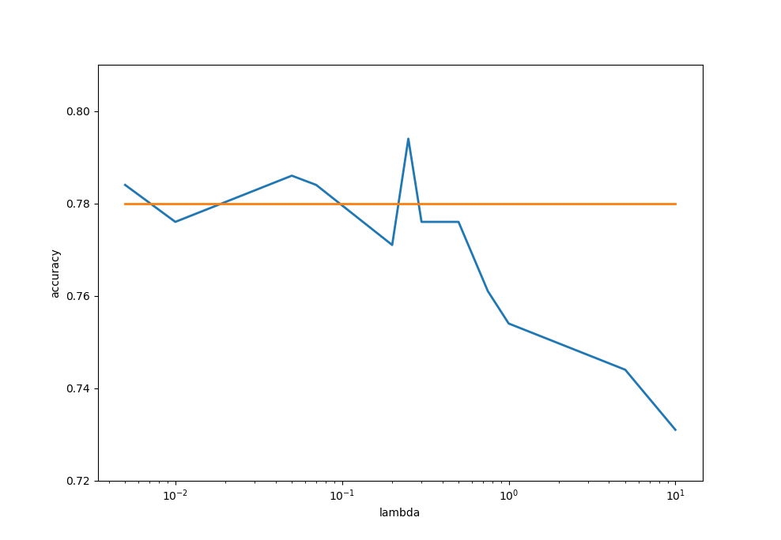

### Foreseer Group Entrance Examination

You can run main.py by 

```shell
python main.py
```

Cora dataset is unploaded in ./data

The lambda tuning is shown in next image.



#### Note: Formula Correction

I have just find a problem in Eq.1, the correct version when f(X) returns a matrix is:
$$
L_{reg} = \sum_{i,j}A_{ij}||f(X_i)-f(X_j)||^2=trace(f(X)^T\Delta f(X))
$$
and even if f(X) is a vector rather than a matrix Eq.1 still have its problem, the correct version is:
$$
L_{reg} = \sum_{i,j}A_{ij}||f(X_i)-f(X_j)||^2=2f(X)^T\Delta f(X)
$$
These two correction is proved by myself and I have some experiment to show they are correct. Moreover, they have been proved by Belkin & Niyogi, 2003 in this paper: http://www2.imm.dtu.dk/projects/manifold/Papers/Laplacian.pdf 

